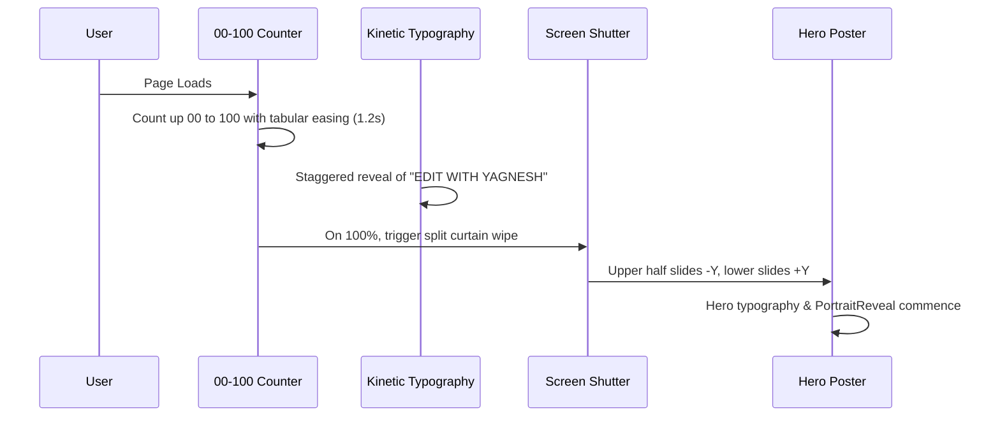

# ANIMATION PLAN & MOTION CHOREOGRAPHY

**Project:** Premium Portfolio for Yagnesh Chavda — Video Editor & Motion Designer  
**Engine:** GSAP 3 • ScrollTrigger • Lenis Smooth Scroll • Framer Motion • CSS Hardware Acceleration  

---

## 1. Motion Philosophy & Aesthetic Tenets

As a portfolio for a Video Editor and Motion Designer, every animation is an implicit demonstration of editorial pacing, timing, and aesthetic judgment.
- **Cinematic Timing:** Movements favor deceleration (`expo.out`, `power3.out`, `power4.out`) mimicking physical camera lenses, shutter speeds, and film transport mechanisms.
- **Graphic Intentionality:** Animations serve to reveal hierarchy, establish spatial depth, and direct the viewer's focus. We avoid template clichés like bouncy springs, rainbow fades, or arbitrary continuous 3D rotations.
- **Tactile Response:** Interactions feel crisp and immediate (150ms – 250ms), while cinematic reveals unfold with controlled grandeur (800ms – 1400ms).

---

## 2. Easing Curves & Timing Tokens

```typescript
export const MOTION_TOKENS = {
  ease: {
    // Cinematic deceleration for reveals
    cinematic: "power4.out",
    // Smooth editorial curve for layout shifts
    editorial: [0.16, 1, 0.3, 1], // cubic-bezier
    // Snappy response for hover and UI triggers
    snappy: "power2.out",
    // Smooth magnetic follow
    magnetic: "power1.out",
  },
  duration: {
    instant: 0.15,
    quick: 0.3,
    medium: 0.6,
    deliberate: 0.9,
    cinematic: 1.2,
    preloader: 1.5,
  }
};
```

---

## 3. Detailed Component Motion Choreography

### A. Premium Preloader (`Preloader.tsx`)

- **Execution:**
  - Counter text counts smoothly from `00` to `100` using `requestAnimationFrame` with numeric formatting.
  - On completion, top and bottom curtain panels slide open via `clip-path: inset(0 0 100% 0)` / `transform: translateY(-100%)`.
  - Stored in `sessionStorage` so navigating internal sections or refreshing within the session minimizes wait time to 400ms.

---

### B. PortraitReveal Component (A + B + C + E Framework)
The portrait animation is engineered as a multi-stage composite that effortlessly accepts any future photograph while maintaining a high-fashion editorial feel:

1. **Stage A: Hand-Drawn / Sketch Outline Reveal**
   - An SVG overlay containing vector contour paths of the face, jawline, hair silhouette, and eyeglasses.
   - Animated via `stroke-dasharray` and `stroke-dashoffset` from `1000` to `0` over `0.9s` with `power3.out`.
   - Simulates an artist or animator rapidly sketching the figure on paper.

2. **Stage B: Photo-to-Graphic / Halftone Transformation**
   - As the sketch strokes land, a high-contrast monochromatic graphic mask (threshold/halftone plate) dissolves in behind the strokes (`opacity: 0 -> 1`, `mix-blend-mode: multiply` in light mode, `screen` in dark mode).

3. **Stage C: Smooth Cutout Unmasking**
   - The full-color, high-resolution portrait fades into view with a delicate bottom gradient mask (`mask-image: linear-gradient(to bottom, black 70%, transparent 100%)`).
   - The transition creates the illusion of an editorial illustration springing to life into photographic reality.

4. **Stage E: Interactive Mouse Magnetic Tilt**
   - As the user moves their cursor across the hero area, the portrait gently tilts in 3D perspective:
     ```typescript
     const rotateX = (mouseY - centerY) * -0.04;
     const rotateY = (mouseX - centerX) * 0.04;
     gsap.to(portraitRef.current, {
       rotateX,
       rotateY,
       transformPerspective: 1000,
       duration: 0.6,
       ease: "power1.out"
     });
     ```
   - Adds a tactile, dimensional presence to the hero section.

---

### C. Scroll System & Lenis Smooth Scroll
- **Smooth Scroll Config:**
  ```typescript
  import Lenis from 'lenis';

  const lenis = new Lenis({
    duration: 1.2,
    easing: (t) => Math.min(1, 1.001 - Math.pow(2, -10 * t)),
    orientation: 'vertical',
    gestureOrientation: 'vertical',
    smoothWheel: true,
  });
  ```
- Seamlessly synchronizes with GSAP `ScrollTrigger.update`.

---

### D. ScrollTrigger Reveal Patterns
1. **Editorial Masked Image Reveals:**
   - Applied to project cards and showcase thumbnails.
   - Initial state: `clip-path: polygon(0 0, 100% 0, 100% 0, 0 0)`.
   - On view: `clip-path: polygon(0 0, 100% 0, 100% 100%, 0 100%)` with duration `0.8s`, ease `power3.out`.
2. **Parallax Media Offset:**
   - Images inside containers shift subtly on scroll (`yPercent: -10` to `yPercent: 10`) giving depth between the fixed graph-paper background and the foreground media.
3. **Kinetic Horizontal Ticker:**
   - Infinite continuous marquee text (`MOTION DESIGNER • VIDEO EDITOR • COLORIST • CREATIVE DIRECTOR`) scrubbed by scroll velocity.

---

### E. Custom Cursor System (`CustomCursor.tsx`)
1. **Default State:**
   - Small minimal circle (`8px` diameter, `--accent-primary` color).
   - Follows cursor with smooth interpolation (`lerp: 0.18`).
2. **Hover Over Video / Media:**
   - Expands to `64px` diameter circular badge.
   - Backdrop filter: `blur(8px)`.
   - Background: `rgba(18, 18, 18, 0.8)` in light mode, `rgba(243, 242, 235, 0.85)` in dark mode.
   - Text inside badge: `PLAY`, `VIEW`, or `WATCH` rendered in bold uppercase monospace.
3. **Hover Over Interactive Links & Buttons:**
   - Expands to `32px` ring with `mix-blend-mode: difference`.
4. **Touchscreen Device Fallback:**
   - Automatically disabled on devices matching `(hover: none) and (pointer: coarse)`.

---

### F. Tactile UI Audio Micro-Interactions (`audio.ts`)
- Leverages the browser's native **Web Audio API** oscillator, guaranteeing 100% reliability with zero external asset loading dependencies.
- **Audio Profile:**
  - Soft UI Click: 750Hz sine tone decaying over 35ms at -24dB.
  - Theme Switch: Harmonic octave chirp (440Hz -> 880Hz) over 60ms.
  - Hover Tick: Faint 1200Hz impulse (20ms) at -32dB.
- Completely silent by default; toggled via the global `SoundToggle` component.

---

### G. Reduced Motion Protocol (`prefers-reduced-motion`)
When the user's system preference has `prefers-reduced-motion: reduce` enabled:
- Parallax offsets are zeroed (`yPercent: 0`).
- Preloader completes instantly without shutter animations.
- The custom cursor is disabled, defaulting to system pointer.
- Clip-path wipes are replaced with subtle, standard opacity fades (`duration: 0.2s`).
