# SITE ARCHITECTURE & COMPONENT SPECIFICATION

**Project:** Premium Portfolio for Yagnesh Chavda — Video Editor & Motion Designer  
**Architecture:** Next.js (App Router) • TypeScript • Tailwind CSS • GSAP / ScrollTrigger • Lenis • Web Audio API  

---

## 1. Page Flow & Complete Section Manifest

The portfolio is architected as a cohesive, cinematic, one-page editorial journey:

```mermaid
graph TD
    Preloader[01. Premium Preloader: 00-100% Counter & Kinetic Reveal] --> Hero[02. Hero: Typographic Poster & PortraitReveal]
    Hero --> Showreel[03. Master Showreel: Cinematic Theater & Timecode]
    Showreel --> SelectedWork[04. Selected Work: Flagship Index & Filter Pills]
    SelectedWork --> About[05. About Me: Editorial Cutout & Two-Column Bio]
    About --> Skills[06. Skills + Software: Interactive Toolchain Matrix]
    Skills --> Experience[07. Experience: Professional Milestones & Impact Metrics]
    Experience --> Services[08. Services: Editorial Craft Cards]
    Services --> MotionGraphics[09. Motion Graphics: Kinetic Visual Lab & Loops]
    MotionGraphics --> ShortContent[10. Short Content: Staggered 9:16 Reels Gallery]
    ShortContent --> CommercialAds[11. Commercial Ads: Widescreen Brand Showcase]
    CommercialAds --> YouTubeEditing[12. YouTube Editing: Long-Form & Documentary Pacing]
    YouTubeEditing --> SocialWork[13. Social Media Ads: UGC & High-Velocity Campaigns]
    SocialWork --> Testimonials[14. Testimonials: Client Endorsements & Studio Stamp]
    Testimonials --> Contact[15. Contact: Editorial Direct Channel & Inquiries]
    Contact --> Footer[16. Footer: Colophon, Local Clock & Back-To-Top]
```



---

## 2. Detailed Section Blueprint

### 1. Premium Preloader (`src/components/ui/Preloader.tsx`)
- **Visuals:** High-contrast minimal canvas with large tabular counter `00%` -> `100%`.
- **Text:** `EDIT WITH YAGNESH` • `VIDEO EDITOR & MOTION DESIGNER`.
- **Behavior:** Completes in 1.2s – 1.5s on initial visit. Checks `sessionStorage` on revisits to minimize or bypass preloader for instant load.
- **Exit:** Shutter split animation revealing the hero poster cleanly.

### 2. Hero / Introduction (`src/components/hero/Hero.tsx`)
- **Visuals:** Massive, oversized typography composition (`PORTFOLIO` / `YAGNESH CHAVDA`).
- **Metadata:** Top left: `VIDEO EDITOR & MOTION DESIGNER`; top right: `2026 / AHMEDABAD, IN`.
- **Center Piece:** The `PortraitReveal` component nestled seamlessly into the typographic composition.
- **Micro-Details:** Brutalist geometric glyphs (8-point star, 4-point sparkle, 4-leaf clover), animated timecode counter `[ REC 00:00:00:00 ]`, smooth anchor link to `#showreel`.

### 3. Master Showreel (`src/components/showreel/Showreel.tsx`)
- **Visuals:** Full-width cinematic theater with film-perforation borders top and bottom.
- **Features:** Embedded player for flagship showreel (`LdFZpN9umMg` or local HD MP4), custom play/pause button, ambient lighting effect, audio wave visualization indicator.
- **Metadata:** `FLAGSHIP REEL 2026 • RUNTIME 01:15 • 4K UHD`.

### 4. Selected Work (`src/components/projects/SelectedWork.tsx`)
- **Concept:** Curated index of flagship works spanning multiple disciplines.
- **Interaction:** Category filter tabs (`ALL`, `COMMERCIAL`, `MOTION`, `SHORT-FORM`, `DOCUMENTARY`), project cards featuring video preview on hover, metadata badges, and click-to-open modal player.

### 5. About Me (`src/components/sections/About.tsx`)
- **Visual Reference:** Inspired by Reference 2 (Quennel Damairo Behance) & Screenshot 1.
- **Layout:** Asymmetric editorial split. Left: High-resolution cutout portrait with subtle bottom gradient fade into canvas. Right: `(02) About Me` section tag, ultra-bold `Yagnesh Chavda` headline, refined editorial paragraph with highlighted key terms, tabular metadata (Location: Ahmedabad, Experience: 2025 - Present, Delivery: 100+ projects).
- **Floating Badge:** Fixed vertical tab badge on right edge with asterisk glyph.

### 6. Skills + Software (`src/components/sections/Skills.tsx`)
- **Visual Reference:** Screenshot 1 & Behance tools specification.
- **Tools:** Adobe Premiere Pro, Adobe After Effects, DaVinci Resolve, Adobe Photoshop, CapCut Pro.
- **Presentation:** Tactile cards with authentic software icons, proficiency levels, primary usage tags, and subtle hover lifts.

### 7. Experience (`src/components/sections/Experience.tsx`)
- **Visual Reference:** Screenshot 1 & verified professional background.
- **Entries:**
  1. *Freelance Video Editor* (2025 – Present | Remote) — 100+ projects, 4.9/5 client rating.
  2. *Video Editor & Content Strategist* (Franchise Insiider Ahmedabad | 2025 – Present) — 40% engagement increase.
- **Presentation:** Editorial timeline with taped-paper cards, tabular metrics, and bulleted achievements.

### 8. Services (`src/components/sections/Services.tsx`)
- **Visual Reference:** Screenshot 1 & Reference 1 services breakdown.
- **Categories:**
  1. Short-Form Content & Viral Reels
  2. Commercial Ads & Brand Films
  3. Motion Graphics & Visual FX
  4. Cinematic Color Grading
  5. YouTube Long-Form & Documentary
  6. Podcast Video & Repurposing
- **Design:** Editorial cards with large numbers `01` – `06`, bold service labels, concise deliverables description, and direct inquiry link.

### 9. Motion Graphics (`src/components/projects/MotionGraphics.tsx`)
- **Visual Reference:** Reference 1 (Behance 253749437) & Screenshot 2.
- **Aesthetic:** Motion-led, kinetic typography, dynamic loops.
- **Projects:** Kinetic Identity (`pdw-C0KuG1c`), Neon Cadence (`Bt1ULc90W1c`), Title Resolve (`eB0LeMK-W5w`).
- **Features:** Auto-playing muted video loop preview on hover, playback duration badges, software tags (`AE + C4D`).

### 10. Short Content (`src/components/projects/ShortContent.tsx`)
- **Visual Reference:** Reference 2 (Behance 242441991) & Screenshot 3.
- **Layout:** Curated 9:16 vertical reels gallery with staggered heights.
- **Projects:** Event Reel (`4qYfxXVyj8I`), Factory Reel (`QQSsIql5pE0`), ASMR Product Reel (`4mnzYMU9hvI`), Quiz Reel (`pOkGv6A3zU0`).
- **Details:** High-retention chips, duration stamps, view overlays, tap to expand into full-screen theater.

### 11. Commercial Ads (`src/components/projects/CommercialAds.tsx`)
- **Concept:** High-impact widescreen (16:9) commercial spots for brands.
- **Media Priority:** Video > Image > Text. Large edge-to-edge aspect ratio cards.
- **Projects:** The Modern Craft (`rlXpsCngDTg`), Heritage & Vision (`reBNdt5A5Zw`), Industrial Pulse (`hHpQ4ueZFYE`).

### 12. YouTube Editing (`src/components/projects/YouTubeWork.tsx`)
- **Concept:** Long-form narrative and documentary editing.
- **Visuals:** Cinematic thumbnail frames with timecode overlays, retention arc indicators, chapter markers.

### 13. Social Media Ads / Reels (`src/components/projects/SocialWork.tsx`)
- **Concept:** Performance marketing, UGC ads, creator campaign edits.
- **Layout:** Fast-paced dynamic grid of vertical videos with hook breakdowns and sound design callouts.

### 14. Testimonials (`src/components/testimonials/Testimonials.tsx`)
- **Visuals:** Tactile editorial cards with quote marks, 5-star rating stars, client headshots/avatars, verified roles.
- **Quotes:** Rushin Panchal (Creative Director) & Dhruvin Sathwara (Influencer & Host).
- **Detail:** Studio verification stamp `VERIFIED CREATOR FEEDBACK • 2026`.

### 15. Contact / Let's Work Together (`src/components/contact/Contact.tsx`)
- **Concept:** Cinematic invitation for new projects.
- **Features:** Direct email with 1-click clipboard copy (`yagnesh6650@gmail.com`), availability status pill (`● AVAILABLE FOR Q3/Q4 2026`), streamlined contact form, social links.

### 16. Footer (`src/components/footer/Footer.tsx`)
- **Content:** Large editorial signature typography, live local time ticker (`Ahmedabad, IN (GMT+5:30)`), copyright notice `© 2026 Yagnesh Chavda`, Back to Top smooth scroll trigger.

---

## 3. Global Controllers & Utility Systems

1. **Navigation Bar (`src/components/navbar/Navbar.tsx`)**:
   - Minimal floating pill header with glassmorphism backdrop.
   - Anchor links: `WORK`, `ABOUT`, `SERVICES`, `CONTACT`.
   - Dedicated `ThemeToggle` (Light / Dark mode toggle with smooth color-token transitions).
   - Dedicated `SoundToggle` (Sound ON / OFF toggle).
   - Mobile full-screen slide-down drawer with large editorial typography.
2. **Custom Cursor (`src/components/ui/CustomCursor.tsx`)**:
   - Lightweight, hardware-accelerated mouse follower.
   - Smooth interpolation (`lerp: 0.15`).
   - Expands on hover over video cards with contextual action text: `PLAY`, `VIEW`, `WATCH`.
   - Gracefully disabled on touchscreen devices (`pointer: coarse`).
3. **Modal Video Player (`src/components/ui/VideoModal.tsx`)**:
   - Universal high-performance video lightbox.
   - Embeds responsive YouTube video player with `autoplay=1`.
   - Shows project title, category, year, duration, and detailed breakdown.
   - Accessible: Keyboard Escape to close, focus trap, aria labels.
4. **Subtle UI Audio Engine (`src/lib/audio.ts`)**:
   - Built using Web Audio API synthesis (pure sine/triangle oscillations at low decibels) requiring zero external audio assets.
   - Subtle acoustic clicks on navigation and theme toggle.
   - Controlled by global `SoundToggle` state (default: OFF).

---

## 4. File Tree Architecture

```
├── src/
│   ├── app/
│   │   ├── layout.tsx             # Root layout, font definitions, theme provider
│   │   ├── page.tsx               # One-page assembly with Lenis smooth scroll
│   │   ├── globals.css            # Design tokens, grid patterns, tape styles
│   ├── components/
│   │   ├── navbar/
│   │   │   ├── Navbar.tsx         # Responsive header
│   │   │   ├── ThemeToggle.tsx    # Light / Dark mode switcher
│   │   │   └── SoundToggle.tsx    # Sound ON / OFF switcher
│   │   ├── hero/
│   │   │   ├── Hero.tsx           # Large typographic poster hero
│   │   │   └── PortraitReveal.tsx # Multi-layer sketch-to-photo reveal
│   │   ├── showreel/
│   │   │   └── Showreel.tsx       # Flagship theater video
│   │   ├── sections/
│   │   │   ├── About.tsx          # Editorial bio & metadata
│   │   │   ├── Skills.tsx         # Software grid & proficiencies
│   │   │   ├── Experience.tsx     # Timeline & achievements
│   │   │   └── Services.tsx       # Service cards
│   │   ├── projects/
│   │   │   ├── SelectedWork.tsx   # Curated flagship gallery
│   │   │   ├── MotionGraphics.tsx # Reference 1 motion section
│   │   │   ├── ShortContent.tsx   # Reference 2 vertical reels
│   │   │   ├── CommercialAds.tsx  # Widescreen commercials
│   │   │   ├── YouTubeWork.tsx    # Long-form documentary
│   │   │   ├── SocialWork.tsx     # UGC & social campaign reels
│   │   │   ├── ProjectCard.tsx    # Reusable card component
│   │   │   └── VideoModal.tsx     # High-fidelity video lightbox
│   │   ├── testimonials/
│   │   │   └── Testimonials.tsx   # Verified client feedback
│   │   ├── contact/
│   │   │   └── Contact.tsx        # Inquiries & direct email
│   │   ├── footer/
│   │   │   └── Footer.tsx         # Colophon & live clock
│   │   └── ui/
│   │       ├── Preloader.tsx      # 00-100% kinetic preloader
│   │       ├── CustomCursor.tsx   # Interactive magnetic cursor
│   │       ├── SectionHeading.tsx # Reusable editorial header
│   │       ├── Glyphs.tsx         # Custom vector stars, clovers, tape
│   │       └── TapedBadge.tsx     # Tactile taped accent
│   ├── data/
│   │   ├── site.ts                # Bio, social links, meta configs
│   │   └── projects.ts            # Centralized project catalog
│   ├── hooks/
│   │   ├── useTheme.ts            # LocalStorage & media-query theme hook
│   │   └── useSound.ts            # Web Audio API sound hook
│   └── lib/
│       ├── audio.ts               # Synthesizer sound generator
│       └── utils.ts               # Helper functions (cn, formatTime)
```

---

## 5. Performance, Accessibility & SEO

1. **Video Optimization:**
   - Preload strategy: `preload="metadata"`.
   - Poster frames for all videos to eliminate layout shifts.
   - IntersectionObserver to auto-pause offscreen videos and reduce GPU workload.
2. **Accessibility (a11y):**
   - W3C WCAG 2.1 AA color contrast compliance in both Light and Dark modes.
   - Keyboard accessible modals and controls.
   - `prefers-reduced-motion` media query integration (disables parallax, softens transitions, hides custom cursor).
3. **SEO & Metadata:**
   - Semantic heading tree (`H1` in Hero, `H2` for major sections, `H3` for projects).
   - Rich JSON-LD Schema: `Person` and `VideoObject`.
   - OpenGraph & Twitter Card tags with preview poster.
